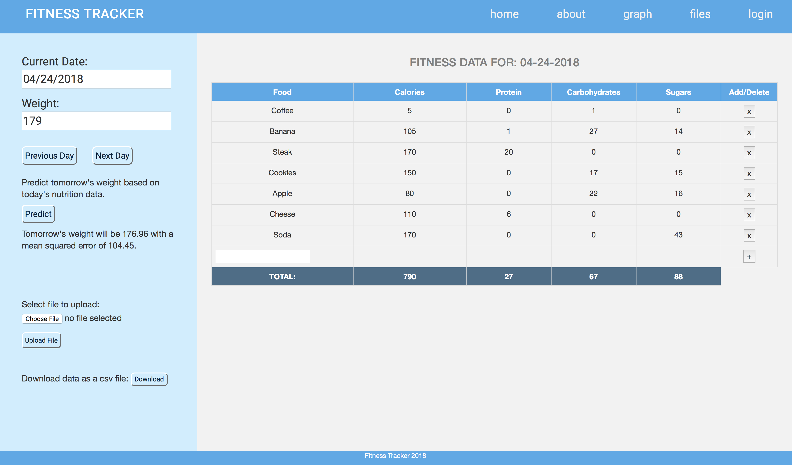
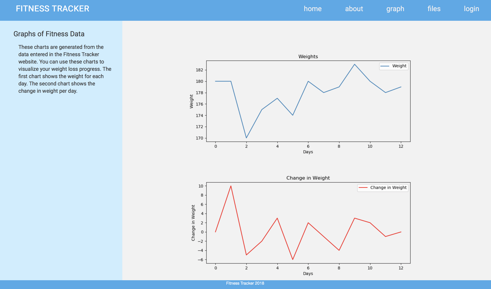
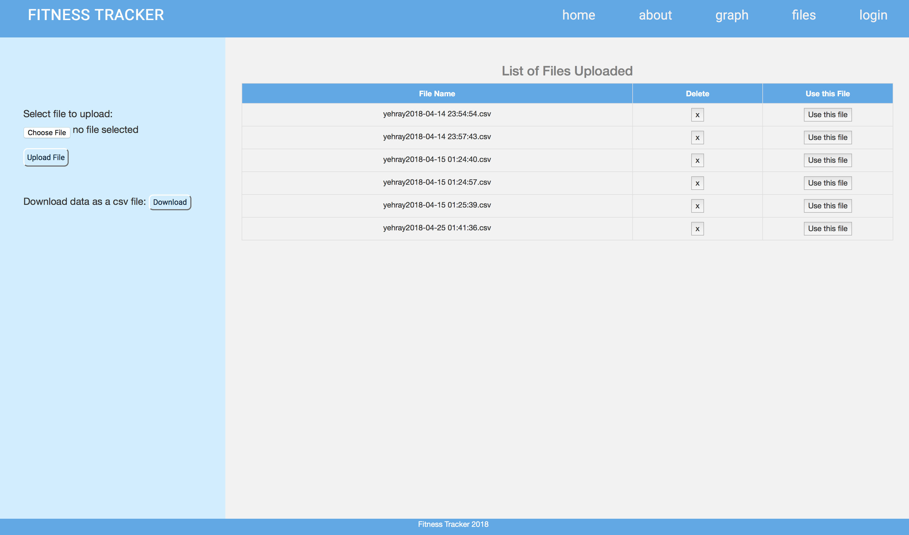

# Fitness Tracker
Web application to track and predict progress with weight loss based on caloric intake. 
 
Main Page 
 
****

Charts Page 
 
****

List of Files Page 
 
****

 

# Features

* Users enter in the types of food eaten each day in the table on the main page. 
* Each entry for food needs to have the food name, number of calories, grams of protein, grams of carbohydrates, and grams of sugar. 
* Some commonly eaten foods are already saved and will autopopulate all of the nutrition data when selected in the search bar in the table. 
* The bottom of the table shows the total amount of calories, protein, carbohydrates, and sugars eaten each day. 
* In order to use the learner, the user must also record their wiehgt for each day. 
* Users can edit fitness data for each day 
* Users can also upload their own data or download the data saved in the website. 
* Users can pick which one of their uploaded files to use for the website.  

